# Jyotish Vedic Transit App Redesign Blueprint

## 1. Information Architecture (IA)

The app will feature a bottom navigation bar with four primary tabs, structured for "Layered Complexity" to serve both casual users and advanced Jyotishis.

### Tab 1: Dashboard ("At-a-Glance")
*   **Top Bar:** User Profile Selector (switch between saved charts) & Quick Settings (Ayanamsa toggle).
*   **Hero Section: "Gochara Score"**
    *   Unified circular progress bar (0-100%) indicating current transit strength based on Ashtakavarga, dignity, and temporary friendships.
    *   Current active Mahadasha / Antardasha displayed prominently inside or near the circle.
*   **"Transit Weather Report" Cards (Level 1)**
    *   Plain-English summaries of major active transits (e.g., "Saturn transiting your 10th house: High career focus, heavy workload").
    *   Visual indicators of positive (green) or challenging (orange/red) energies.
*   **Sade Sati / Dhaiya Micro-Dashboard**
    *   Only visible if active for the user.
    *   Shows current phase (Rising, Peak, Setting) and progress.
*   **Calculation Toggle (Subtle)**
    *   Switch primary reference from Chandra Lagna (Moon - Default) to Janma Lagna (Ascendant) or Dasha Lord.

### Tab 2: Sky-Timeline (Interactive Transit Scrubber)
*   **Horizontal Scrollable Timeline**
    *   Allows users to slide forward/backward in time (days, weeks, months).
*   **Dynamic Gochara Score Graph**
    *   A line or bar chart that shifts dynamically as the user scrubs the timeline, showing when transit scores rise or fall.
*   **Transit Event Markers (Gochara Rashi Parivartan)**
    *   Pins on the timeline indicating exact moments a planet changes signs, turns retrograde (Vakra), or goes direct (Margi).
*   **Event Details Panel**
    *   When tapping a marker, a bottom sheet expands detailing the planetary shift and its projected impact based on the user's chart.

### Tab 3: Deep Jyotish View (Level 3 - Advanced)
*   **Chart Style Toggle:** North Indian (Diamond) / South Indian (Square) / East Indian (optional).
*   **Dual-Chart Interface**
    *   Natal chart (inner/left) overlayed with Transit chart (outer/right).
*   **Detailed Planetary Data Grid**
    *   Exact degrees, Nakshatra, Pada, Retrograde status, and Combustion.
*   **Ashtakavarga & Kakshya Panel**
    *   Bindu counts for the transiting signs.
    *   Kakshya strengths (identifying which planetary zone a transiting planet is in).
*   **Vedha (Obstruction) Indicators**
    *   Visual lines or markers showing if a beneficial transit is blocked (Vedha) or if a malefic transit is mitigated (Vipareeta Vedha).

### Tab 4: Dasha Matrix & Authentic Remedies (Upayas)
*   **Active Dasha Context Engine**
    *   Detailed view of current Vimshottari Mahadasha, Antardasha, and Pratyantardasha.
    *   Explanation of how current transits are modifying the active Dasha promises (e.g., "Jupiter transit is activating your Rahu Dasha results...").
*   **Remedy (Upaya) Engine**
    *   Hyper-personalized, sattvic remedies based on transiting afflictions.
    *   **Mantra Section:** Audio frequencies and correct pronunciation guides.
    *   **Charity (Daan):** Suggestions for specific days and items.
    *   **Lifestyle & Diet:** Fasting days or dietary adjustments aligned with planetary deities.

---

## 2. Predictive Logic Example (Flowchart)

**Scenario:** Calculating a prediction for "Jupiter transit through the 5th house from the Moon, modified by an Ashtakavarga score of 3 points and an active Rahu Dasha."

```mermaid
graph TD
    A[Start: Evaluate Jupiter Transit] --> B{Calculate Reference Point}
    B -->|Default: Chandra Lagna| C[Jupiter is in 5th House from Moon]

    C --> D[Retrieve Classical Baseline Result]
    D --> E["Phaladeepika/BPHS: Jupiter in 5th gives childbirth, knowledge, royal favor (Highly Positive)"]

    E --> F{Evaluate Ashtakavarga Score for Sign}
    F -->|Score = 3 Bindus| G[Score < 4: Sub-optimal strength]

    G --> H[Modify Baseline Result]
    H --> I["Result is diluted. Benefits require more effort, potential delays in 5th house matters."]

    I --> J{Evaluate Dasha Context}
    J -->|Active Dasha: Rahu| K[Check Rahu-Jupiter relationship in Natal Chart]
    K --> L["Rahu & Jupiter create Chandal Yoga tendencies, but Jupiter expands Rahu's ambition."]

    L --> M[Synthesize Final Prediction]

    M --> N["Final Output to User: 'Jupiter in your 5th house brings opportunities for learning and speculative gains, driven by intense ambition (Rahu Dasha). However, with a lower transit strength (3 points), you must avoid over-speculation and ensure your decisions are grounded in ethics. Success comes with structured effort.'"]
```

*(Note: While Mermaid flowchart syntax is used here for structural clarity, the logic flows linearly as described in the text blocks.)*

---

## 3. UI Design System & Theme

The goal is to blend ancient Vedic wisdom with modern, sleek software design, avoiding generic "mystical" tropes in favor of clean typography and meaningful color psychology.

### Typography
*   **Primary Font (Headings & Classical Terms):** *Cinzel* or *Playfair Display* (Serif). Conveys authority, antiquity, and elegance. Used for names of planets, Rasis, and classical quotes.
*   **Secondary Font (Body & UI Elements):** *Inter* or *SF Pro* (Sans-serif). Ensures maximum legibility for dense astrological data, numerical values, and general navigation.
*   **Hierarchy:** Clear contrast between classical Sanskrit terms (italicized or serif) and English explanations (sans-serif) to help users distinguish between tradition and interpretation.

### Color Psychology (Modern Vedic Palette)
*   **Theme Engine:** Provide both Light and Dark modes. Dark mode is preferred for astronomical apps, suggesting the night sky.
*   **Background (Dark Mode):** Deep Indigo/Midnight Blue (`#0B0F19`) rather than pure black, reducing eye strain and evoking the cosmos.
*   **Background (Light Mode):** Off-white/Parchment (`#F9F7F1`) to evoke ancient manuscripts.
*   **Primary Accents (Sattvic Colors):**
    *   *Saffron/Gold (`#F59E0B`):* Used for primary actions, the Sun, Jupiter, and the Gochara Score highlight. Represents spiritual purity and wisdom.
    *   *Vermilion/Coral (`#EF4444`):* Used sparingly for Mars or alert states (like challenging transits).
    *   *Silver/Lunar White (`#E2E8F0`):* Used for Moon-related data and primary text in dark mode.
*   **Planetary Color Coding (Subtle):** Use traditional planetary colors as subtle dots or highlights rather than overwhelming blocks of color (e.g., Saturn = Dark Blue/Black, Venus = Bright White, Mercury = Emerald Green).

### Component Layout & Styling
*   **Neumorphism/Glassmorphism:** Use subtle frosted-glass effects (Glassmorphism) for cards layered over the deep blue background to create a sense of depth ("Layered Complexity").
*   **Card-Based UI:** Information should be chunked into cards with generous padding (border-radius: 12px or 16px). This prevents the "cluttered grid" feel of traditional astrology software.
*   **Micro-interactions:** Smooth, purposeful animations. When a user scrubs the timeline, the transition of planets between signs should feel fluid, not jarring.
*   **Accessibility:** High contrast ratios for exact degrees and Bindu counts to ensure legibility for all ages.

---

## 4. Push Notification Blueprint

**Philosophy:** Notifications must be actionable, contextualized by Dasha, and rooted in classical principles.

**Structure of a Notification:**
1.  **The Event:** (What is happening astronomically?)
2.  **The Impact:** (What house/planet does it affect from the Moon?)
3.  **The Actionable Advice:** (Classical Upaya translated for modern life.)

**Examples:**
*   *Transit Entry:* "Mars enters your 8th house tonight, aspecting your natal Moon. Drive carefully over the next 45 days and avoid impulsive arguments."
*   *Sade Sati Alert:* "Saturn transitions into its Peak phase of your Sade Sati today. Remember your daily Hanuman Chalisa and prioritize discipline in your routines."
*   *Gochara Score Shift:* "Your Gochara Score just increased to 82%! Benefic Venus is now in your 11th house of gains. A great week for networking."
*   *Vedha (Obstruction) Alert:* "Jupiter's positive transit is currently obstructed (Vedha) by the Sun for the next 14 days. Delay major financial decisions until the 15th."